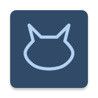
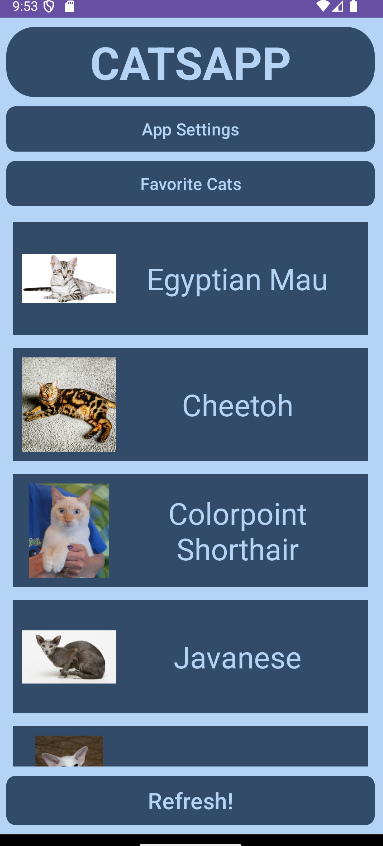
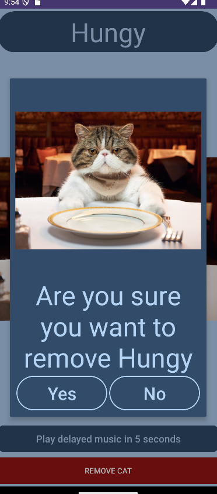

# 😺 Catsapp 

Catsapp is an Android application which allows you to find cat images on [The Cat API](https://thecatapi.com) REST endpoint.

Awesome app for cat lovers!

## Features

- Search for cat images with a breed name attached.
- Look at the breed on Wikipedia.
- Give them a name and add them to your favorite list.
- View them again in the favorite list.
- Interact with them for fan.
- Supreme error handling for unfortunate events.
- Minimalist esthetic centered around a powerful two color palette.
- Set reminders for to revisit cats with the usage of Broadcast Recivers.
- 

## Technologies
This project uses advance Android technologies.

- **Kotlin Programming Language**: A modern programming language with concise yet expressive syntax.
- **MVVM Architecture**: A powerful pattern for creating responsive UI.
- **Hilt**: Dependancy injection library which Kotlin utilizes annotations.
- **ROOM**: And SQLite database with type checked queries.
- **Retrofit**: A library for accessing an API endpoint, in this case, [The Cat API](https://thecatapi.com).

## Preview

### Main Screen

### Example for a cat view 

## Authers

- Anton Gorov, Lead developer and designer.